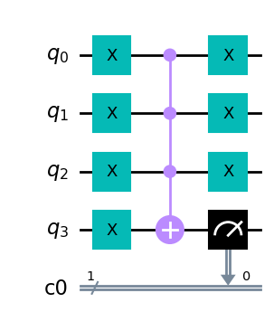

# Circuits and Algorithms

Now that we know what qubits are ([see previous article](https://github.com/jprili/womanium-s23/blob/main/src/intro.md)),
let us now move on utilising qubits for computing.

## Reversible Computing in QC (Quantum Computing) systems
Reversible computing is, to put simply,
a method of computing that is able to get the input state from the output state.
Take the classical AND gate. The truth table shows:

|  a  |  b  | a + b |
|-----|-----|-------|
|  0  |  0  |   0   |
|  1  |  0  |   0   |
|  0  |  1  |   0   |
|  1  |  1  |   1   |

This is an example of **non-reversible** computing.
If given of output of 0, 
there is no way to determine what values `a` and `b` were before applying the gate,
unless it was measured before, which is what a reversible AND gate would be.

|  a  |  b  |  c  |  a   |  b   | a + b |
|-----|-----|-----|------|------|-------|
|  0  |  0  |  0  |  0   |  0   |   0   |
|  1  |  0  |  0  |  1   |  0   |   0   |
|  0  |  1  |  0  |  0   |  1   |   0   |
|  1  |  1  |  0  |  1   |  1   |   1   |

In quantum computing, operations on qubits **must** be reversible.
It stems from quantum mechanics' [unitarity](https://en.wikipedia.org/wiki/Unitarity_(physics)).
In simple terms, the term unitary means that any operations that are applied on the **entire** system will preserve the state's total probability, $P(\Psi) = 1$.  

The picture below shows how a reversible classical gate would be represented, 
and how quantum logic gates are illustrated, with its own truth table.

  
SVG file from *Wikimedia Commons*, please open with a light background if not seen easily.  

Note how the truth table for the quantum gate is written in kets, showing that they are qubits and not classical bits.
Since these are qubits, $\ket{1}$ and $\ket{0}$ are not the only states that they can be in (more on that on the next section).

## Quantum Gates
Like many classical computers, a significant amount of quantum computers (some use [annealing](https://quantumzeitgeist.com/differences-between-quantum-annealers-and-gate-based-quantum-computing/),
mainly used for optimisation problems) use gates to carry out algorithms.
These gates can be represented as rotations on the Bloch sphere, or unitary matrices operating on qubit states.
Following are a some common quantum gates used in QC.

### NOT ($X$, $\bigoplus$)
The `NOT` gate is a $\pi$ radians rotation of the **current state** of the qubit.
This is analogous to the `NOT` gate for classical computers,
only that it operates on qubits and classical bits.
In matrix form:

```math
X = 
\begin{bmatrix}
0 & 1 \\
1 & 0
\end{bmatrix}
```
or 

$$ X (\alpha \ket{0} + \beta \ket{1}) = \beta \ket{0} + \alpha \ket{1} $$

### Hadamard ($H$)
The `H` or Hadamard gate creates a superposition of a qubit.
The mapping goes:

$$ \ket{0} \mapsto \ket{+} $$

and

$$ \ket{1} \mapsto \ket{-} $$

As a matrix, the Hadamard gate will be:

```math
H = \frac{1}{\sqrt{2}} 
\begin{bmatrix}
1 & 1 \\
1 & -1
\end{bmatrix}
```
It is analogous to a coin flip in terms of probabilities, but not the same.

### CNOT ($CX$)
The controlled not gate, or `CNOT` is a `NOT` gate that activates when the control qubit has $\ket{1}$ in its state.
It operates on two qubits and could be extended to add more control qubits 
(called Toffoli gates for two qubits, and multi-controlled `NOT` gates for more).

```math
X =

\begin{bmatrix}
1 & 0 & 0 & 0 \\
0 & 1 & 0 & 0 \\
0 & 0 & 0 & 1 \\
0 & 0 & 1 & 0 
\end{bmatrix}
```

To see a more detailed list on quantum gates, see [*Wikipedia*'s Quantum logic gate page](https://en.wikipedia.org/wiki/Quantum_logic_gate).

## Constructing Circuits, Algorithms
These gates are combined to give the desired behaviours for the qubits.
An example of this is [Grover's Search Algorithm](https://quantum-computing.ibm.com/composer/docs/iqx/guide/grovers-algorithm),
a search algorithm on an unstructured list, 
which is in $O(\sqrt{N})$ instead of the classical solution which has $O(N)$.  

There are a few ways to create a quantum circuit,
IBM has [*Qiskit*](https://qiskit.org/), and Google has [*Cirq*](https://quantumai.google/cirq), 
both decent python libraries for quantum computing.

Let us create a simple multi-`OR` gate.
In this case we will be using *Qiskit*.

Here are the imports needed.
```python
from qiskit import QuantumRegister, ClassicalRegister, QuantumCircuit execute, Aer
from qiskit.circuit.library import XGate
```

Here is how the circuit constructed.
```python
# initialise registers
qreg_q = QuantumRegister(4, 'q')
creg_c0 = ClassicalRegister(1, 'c0')

# instantiate circuit object
circuit = QuantumCircuit(qreg_q, creg_c0)

# add NOT gates on first three qubits
circuit.x(qreg_q[0])
circuit.x(qreg_q[1])
circuit.x(qreg_q[2])
circuit.x(qreg_q[3])
mcx = XGate().control(3)

# last qreg_q is the target qubit
circuit.append(mcx, qreg_q)

circuit.measure(qreg_q[3], creg_c0[0])

# these are added to revert the first three qubits back
# to their original states
circuit.x(qreg_q[0])
circuit.x(qreg_q[1])
circuit.x(qreg_q[2])
```

To check the circuit, we can add extra classical registers and measurements
```python
job = execute(circuit, Aer.get_backend('qasm_simulator'),shots=1000)
counts = job.result().get_counts(circuit)
```

The possible outcomes are shown below:


and would represent the following circuit:


